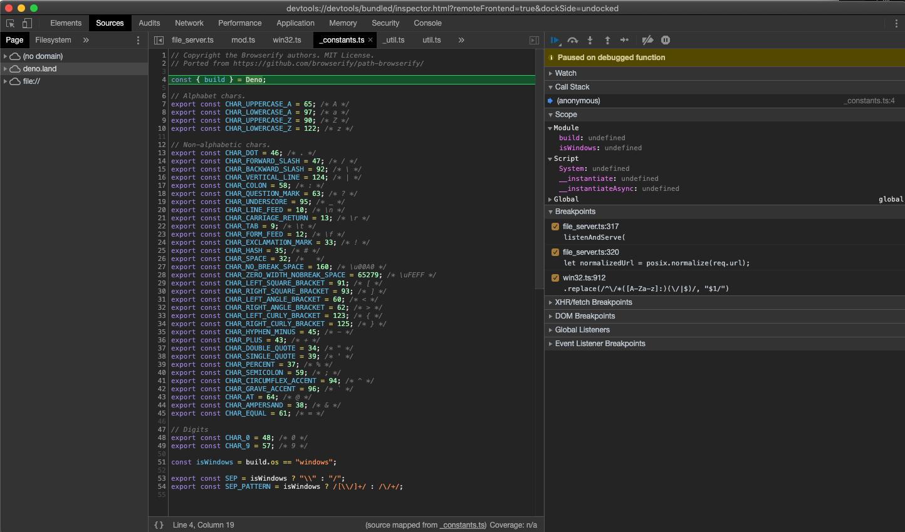
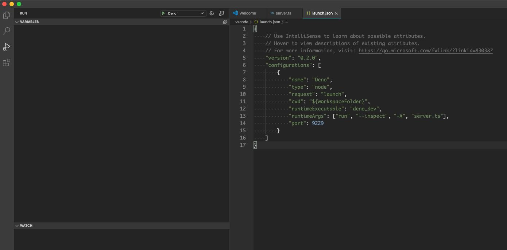

## 调试器 (debugger)

Deno 支持 [V8 Inspector Protocol](https://v8.dev/docs/inspector).

使用 Chrome Devtools 或其他支持该协议的客户端（比如 VSCode）能够调试 Deno 程序。

要启用调试功能，用 `--inspect` 或 `--inspect-brk` 选项运行 Deno。

`--inspect` 选项允许在任何时间点连接调试器，而 `--inspect-brk` 选项会等待调试器连接，在第一行代码处暂停执行。

### Chrome Devtools

让我们用 Chrome 开发者工具来调试一个简单的程序，我们将使用来自 `std` 的 [file_server.ts](https://deno.land/std@v0.50.0/http/file_server.ts)，这是一个简单的静态文件服务。

使用 `--inspect-brk` 选项，在第一行代码处暂停执行。

```shell
$ deno run --inspect-brk --allow-read --allow-net https://deno.land/std@v0.50.0/http/file_server.ts
Debugger listening on ws://127.0.0.1:9229/ws/1e82c406-85a9-44ab-86b6-7341583480b1
Download https://deno.land/std@v0.50.0/http/file_server.ts
Compile https://deno.land/std@v0.50.0/http/file_server.ts
...
```

打开 `chrome://inspect`，点击 target 旁边的 `Inspect`。


开发者工具加载所有模块时可能会等待几秒。



您可能注意到开发者工具暂停执行的地方不是 `file_server.ts`，而是 `_constants.ts` 的第一行。这是符合预期的行为，ES 模块在 V8 中执行的顺序如此。`_constants.ts` 是 `file_server.ts` 最深、最先的依赖，因此它会最先执行。

在这时，所有源码在开发者工具中都可用。打开 `file_server.ts`，加一处断点，然后打开 "Sources" 面板，展开树：


_仔细观察，您会发现每个文件都有重复的条目，一个是正常字体，另一个是斜体。前者是编译后的源文件（所以 `.ts` 文件会生成 JavaScript 源代码），后者是该文件的源映射 (source map)。_

在 `listenAndServe` 方法处加一个断点。


添加断点后，开发者工具会自动打开源映射文件，让我们能在包含类型的实际源码中步进。

现在我们已经设置了断点，在触发断点时，我们可以检查传入的请求，也可以继续执行脚本。点击恢复脚本执行的按钮即可，您可能需要点两次。

当脚本继续运行时，让我们发送一个请求，看看开发者工具中发生了什么。

```
$ curl http://0.0.0.0:4500/
```


在这时，我们可以检查请求的内容，逐步调试代码。

### VSCode

Deno 可以在 VSCode 中调试。

插件的官方支持正在开发中 <https://github.com/denoland/vscode_deno/issues/12>

我们也可以通过手动提供 `launch.json` 配置，来连接调试器：

```json
{
  "version": "0.2.0",
  "configurations": [
    {
      "name": "Deno",
      "type": "node",
      "request": "launch",
      "cwd": "${workspaceFolder}",
      "runtimeExecutable": "deno",
      "runtimeArgs": ["run", "--inspect-brk", "-A", "<entry_point>"],
      "port": 9229
    }
  ]
}
```

**注意**：将 `<entry_point>` 替换为实际的脚本名称。

让我们尝试一下本地源文件，创建 `server.ts`：

```ts
import { serve } from "https://deno.land/std@v0.50.0/http/server.ts";
const s = serve({ port: 8000 });
console.log("http://localhost:8000/");

for await (const req of s) {
  req.respond({ body: "Hello World\n" });
}
```

将 `<entry_point>` 改为 `server.ts`，然后运行。




### 其他

实现 Devtools 协议的任何客户端都能连接 Deno 进程。

### 限制

开发者工具的支持仍不成熟，有一些功能是缺失的，或是有 bug 的：

- 开发者工具控制台中的自动补全会让 Deno 进程退出。
- 性能分析 (profiling) 和内存转储 (memory dump) 可能不正确。
